1. Launch AWS Lighsail

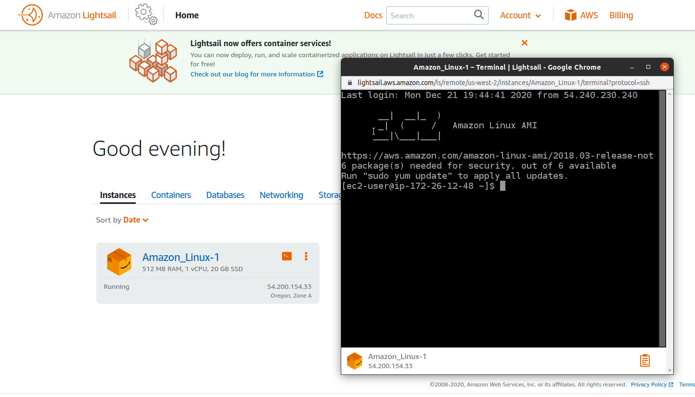

2. Lauch EC2 instance

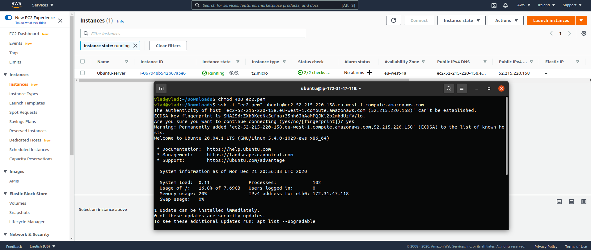

3. Created a snapshot for this instance

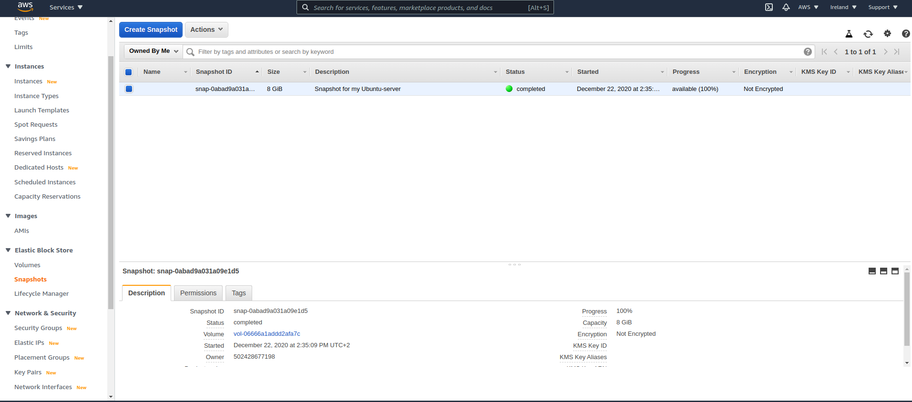

4. Created EBS volume

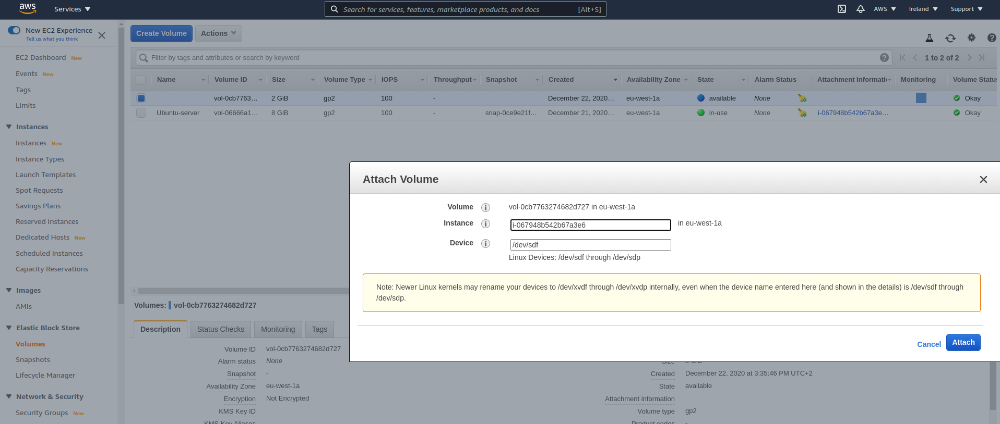

5. Attached this volume to the my instance

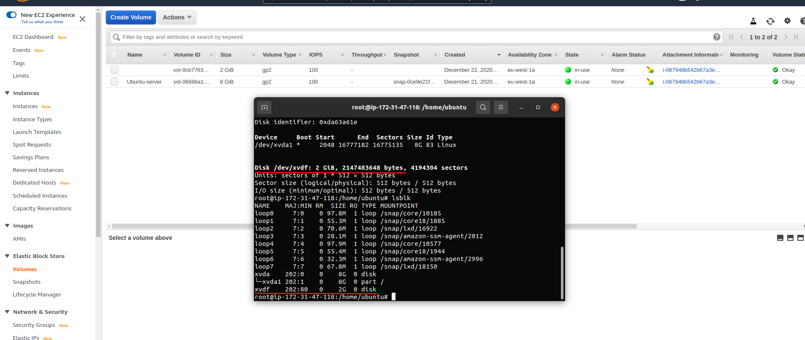

6. Mount EBS Volume to the my instance

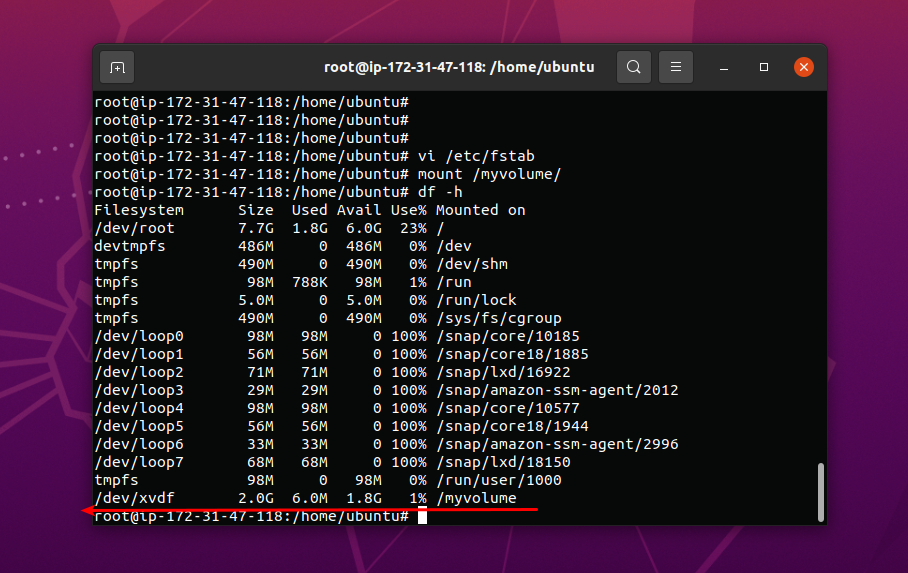

7. Launch third instance from backup

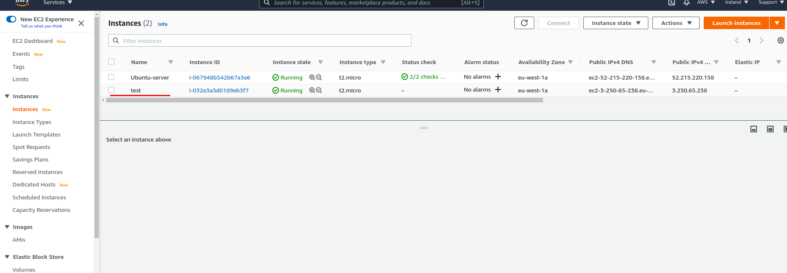

8. Detach EBS from second instance and attach to the new one

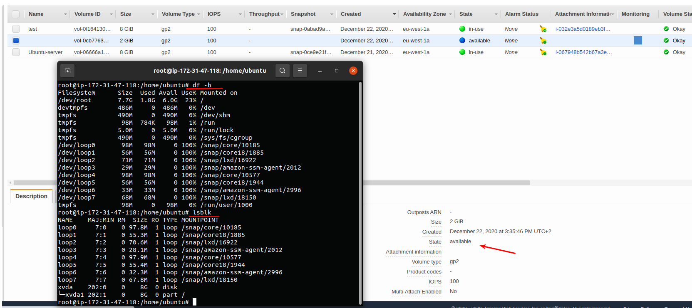

9. Lauch WordPRess Lightsail 

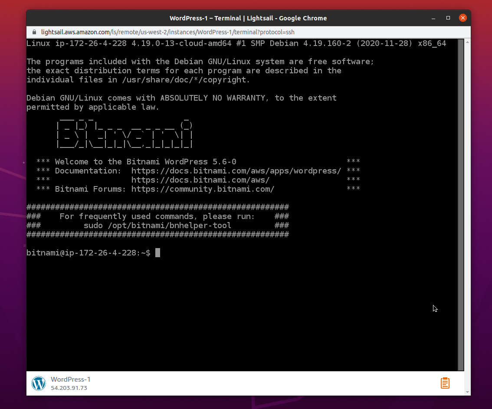

10. Configure it

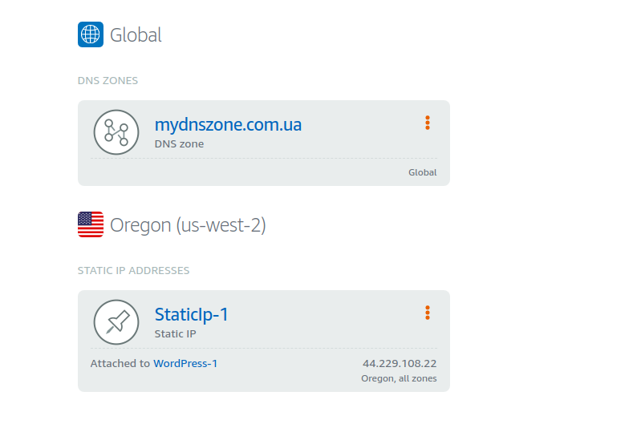

11. Created S3 bucket

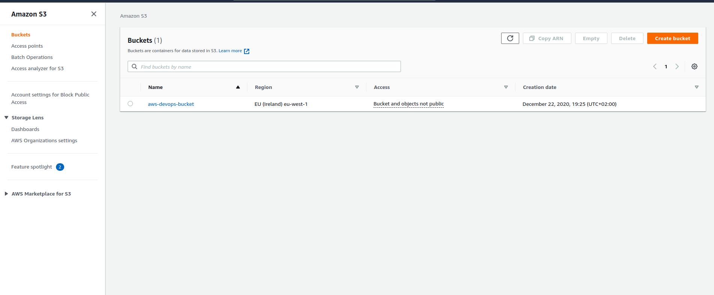

12. Upload some file via AWS CLI

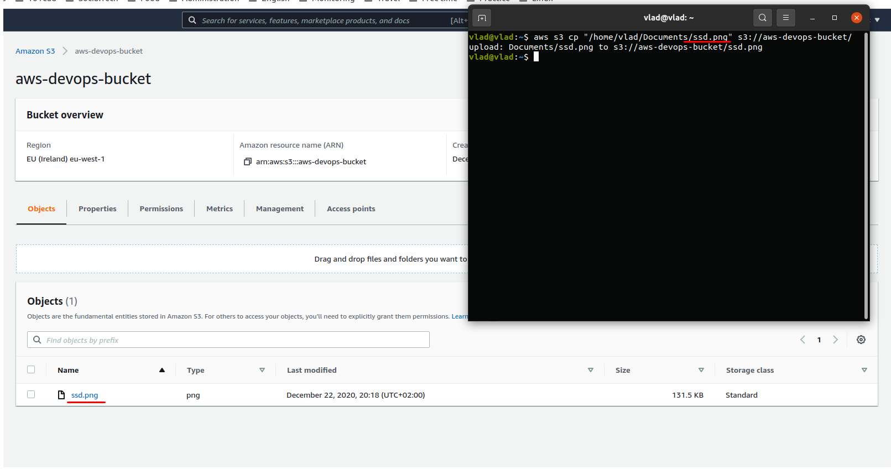

13. Created ECS

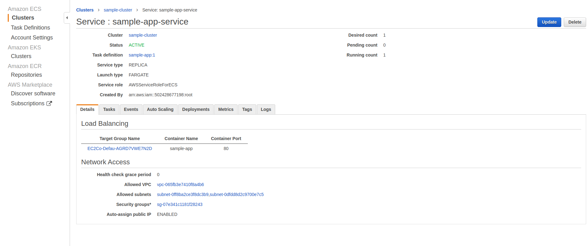

14. Onlime demo application:

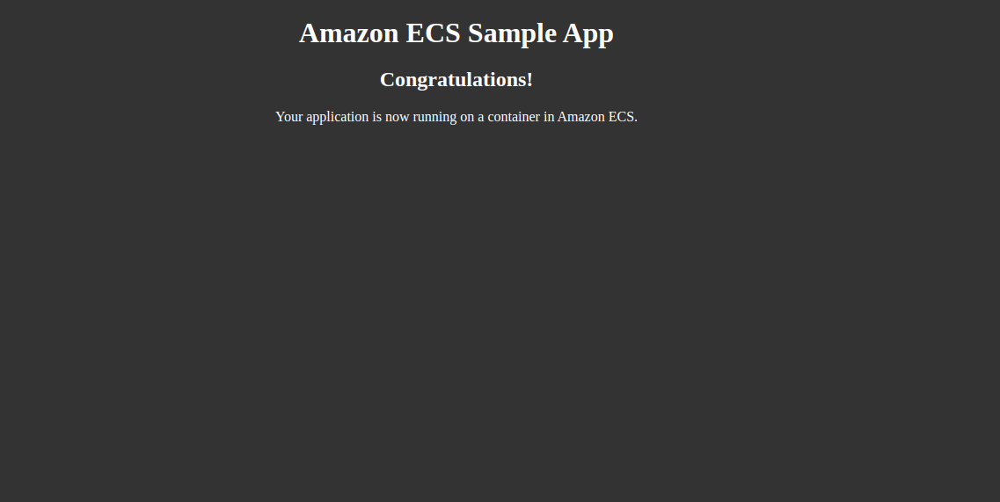

My static website on S3: http://mypersonaldevops3.s3-website-eu-west-1.amazonaws.com/
