1. Creating and clone the VM

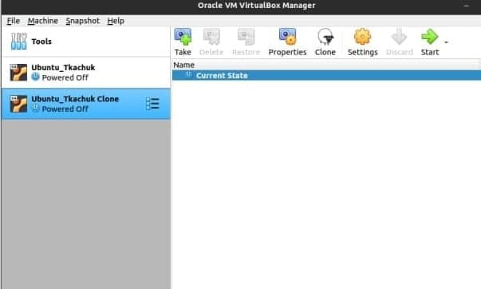

2. Take a snapchot

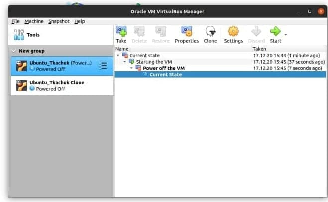

3. Exporting

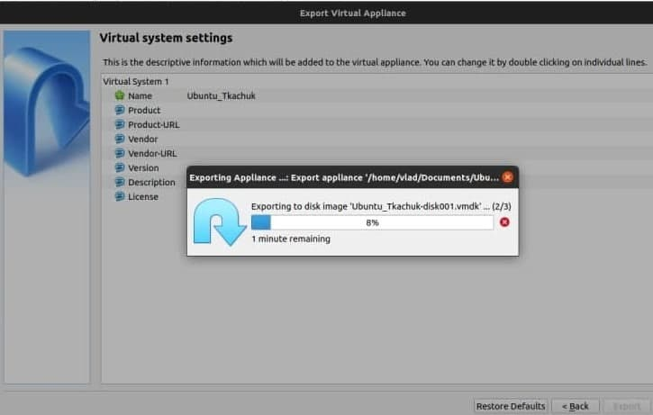

4. Importing

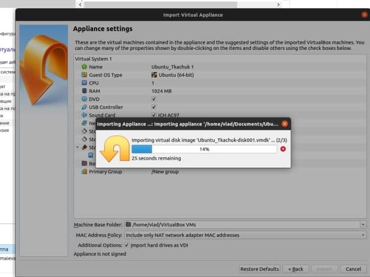

5. Setting up USB

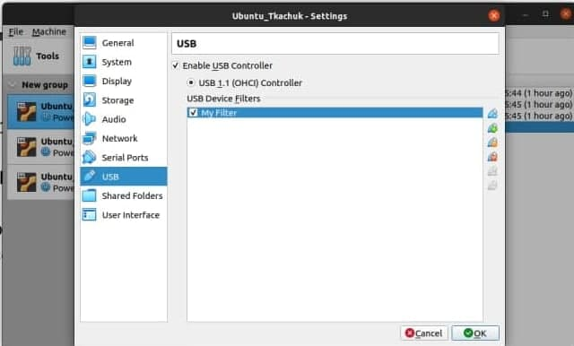

6. Setting up shared folder

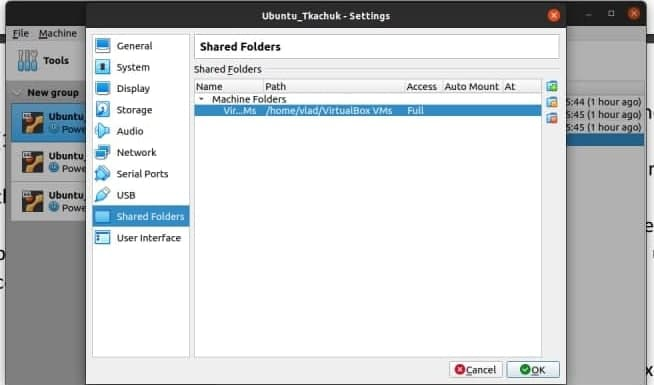

7. VM IP address

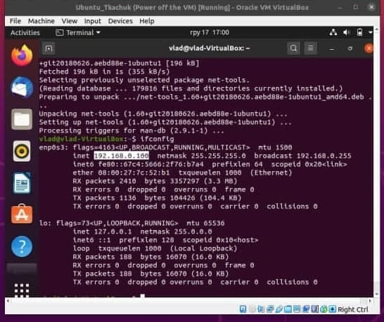

8. Ping this IP from host

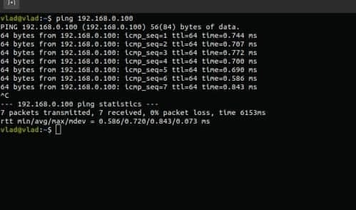

9. Ping the host from VM (Bridged adapter)

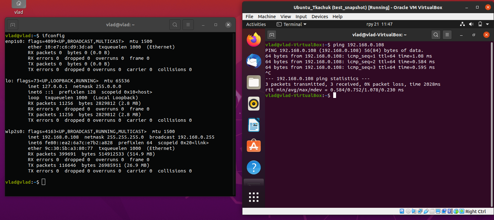

10.Ping the VM from host (NAT adapter)

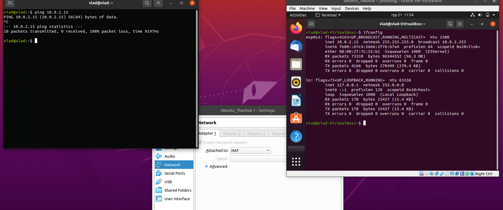

11. Ping the VM's between themselves (Bridged adapter)

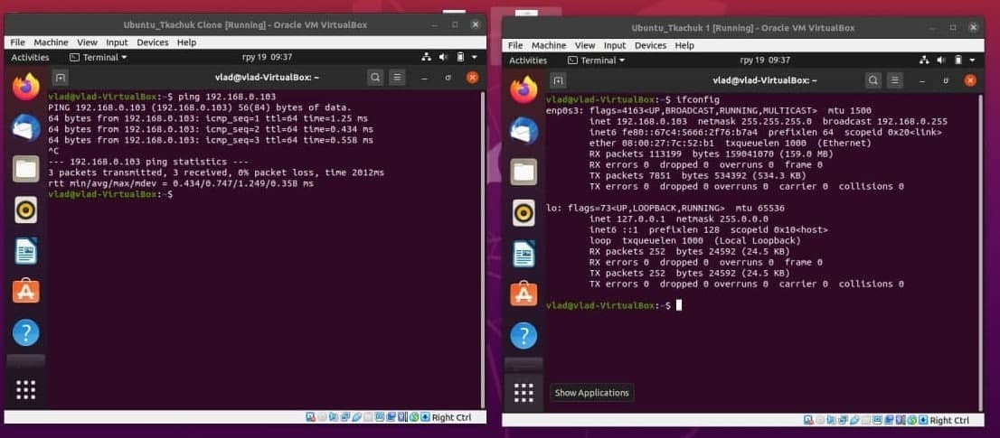

12. Ping the VM's between themselves (NAT adapter)

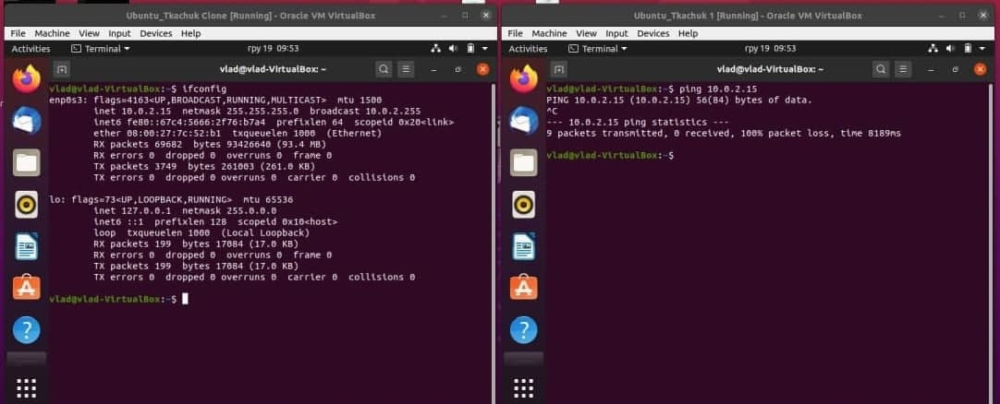

13. Executing some comands from console:

VboxManage list aws

VboxManage staetvm

VboxManage list

VboxSnapshot

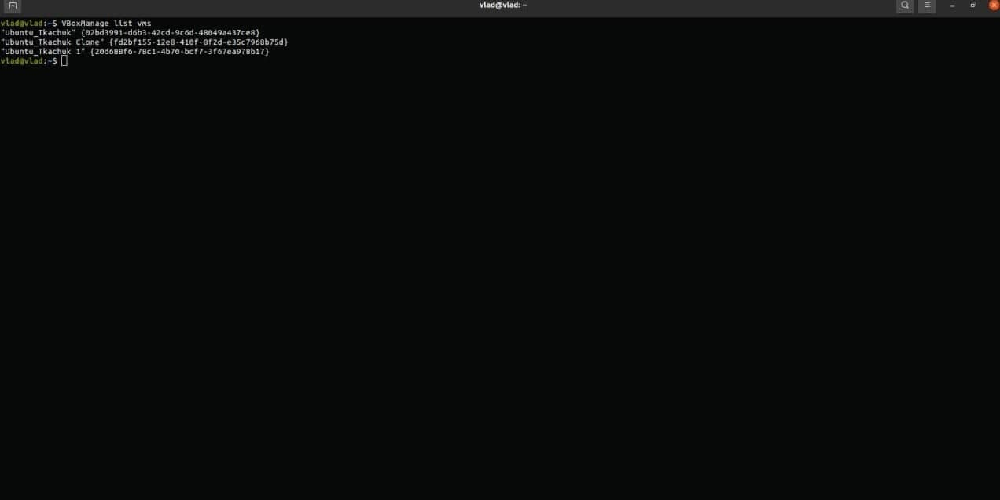

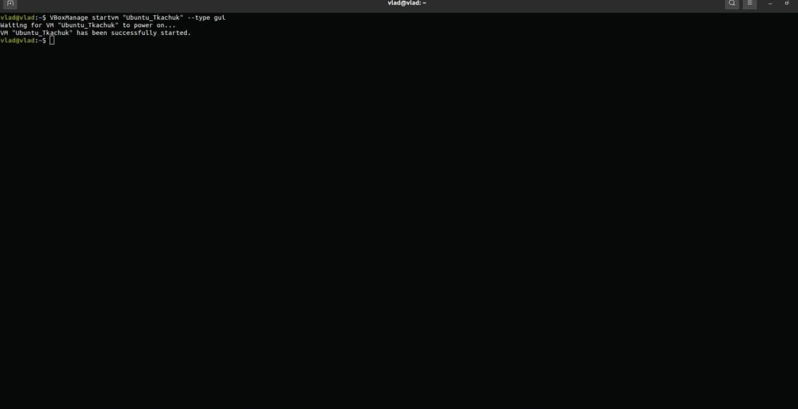

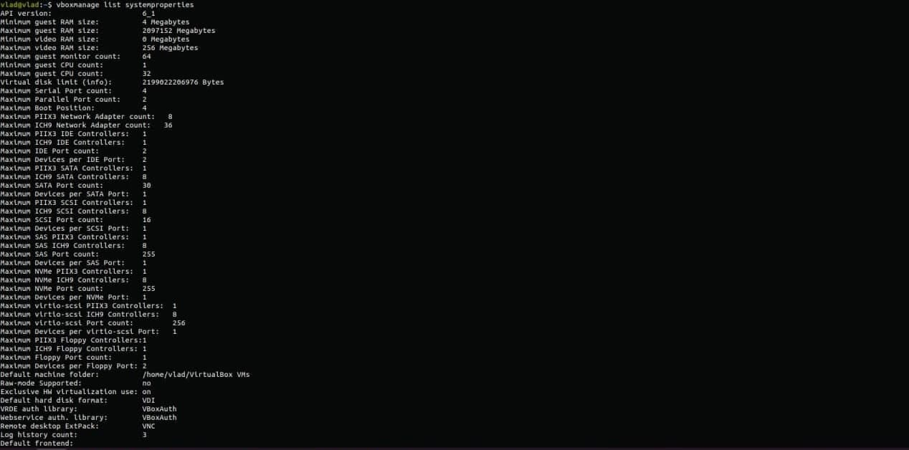

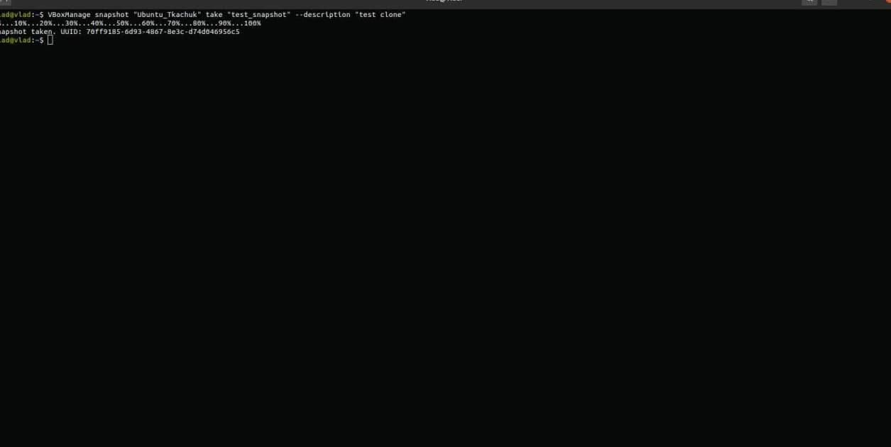

17.Make vagrant init & up

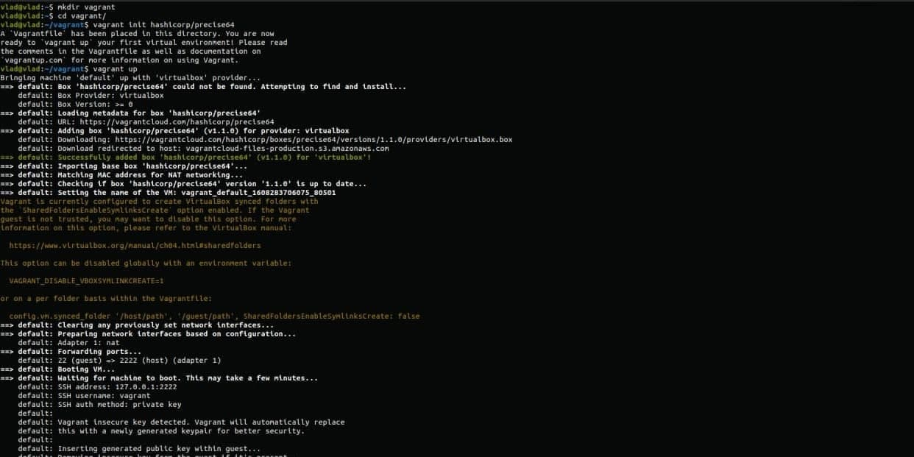

18.Connect to vagrant

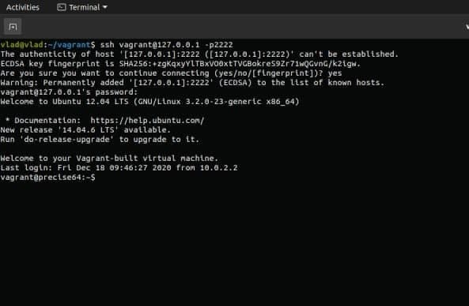

19. Connecting to the VM using PuTTY

21.Stopped and deleted the created VM.

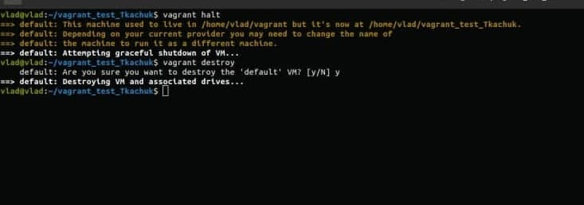
