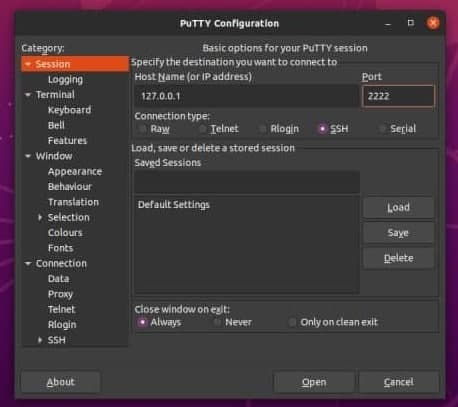

1. Creating and clone the VM

2. Take a snapshot

3. Exporting

4. Importing

5. Setting up USB

6. Setting up shared folder

7. VM IP address:

8. Ping this IP from host

9. Ping the host from VM (Bridged adapter)

10.Ping the VM from host (NAT adapter)

11. Ping the VM's between themselves (Bridged adapter)

12. Ping the VM's between themselves (NAT adapter)

13. Executing some comands from console:

VboxManage list

VboxManage startvm

VboxManage list

VboxSnapshot

17.Make vagrant init & up

18.Connect to vagrant

19. Connecting to the VM using PuTTY

21.Stopped and deleted the created VM.

The most popular hypervisors are: VMWare ESX Server Citrix XenServeer Microsoft Hyper-V

VMWare ESX Server - allows you to partition the resources of a physical computer into logical partitions called virtual machines. Includes tools for managing virtual machines and tools.

Citrix XenServer - fully managed server virtualization that builds on the Xen hypervisor. It is a cross-platform hypervisor that looks like Linux-like operating system.

Microsoft Hyper-V - hardware virtualization system for x64 systems based on a hypervisor. A server computer running Hyper-V can be configured to expose individual virtual machines to one or more networks.

