1. Installed MySQL

         sudo apt-get update
      
         sudo apt-get install mysql-server
      
         mysql_secure_installation
      
  

2. Described the database schema and created a database on the server through the console.
            
         CREATE DATABASE company;
      
         use company;
      
         CREATE TABLES -*
      

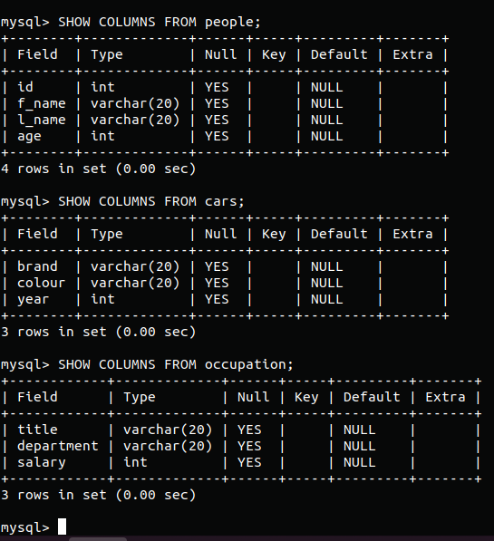

3. Constructed and executed SELECT operator with WHERE, GROUP BY and ORDER BY.

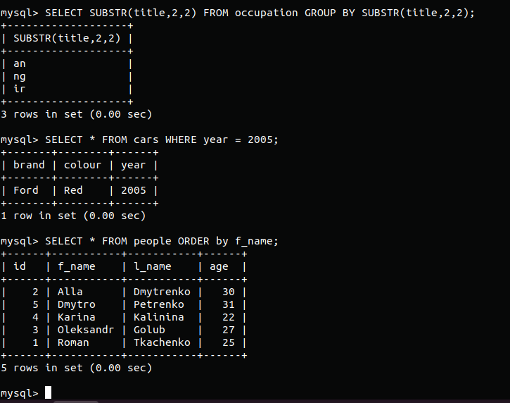

4. Executed other different SQL queries DDL, DML, DCL

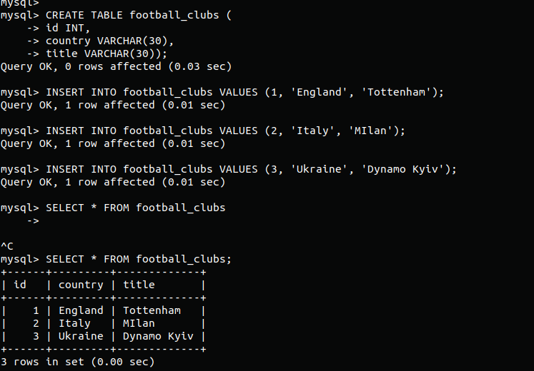
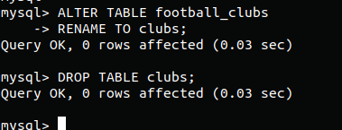

5. Created a new user 'vlad' with only SELECT privileges. Checked it.

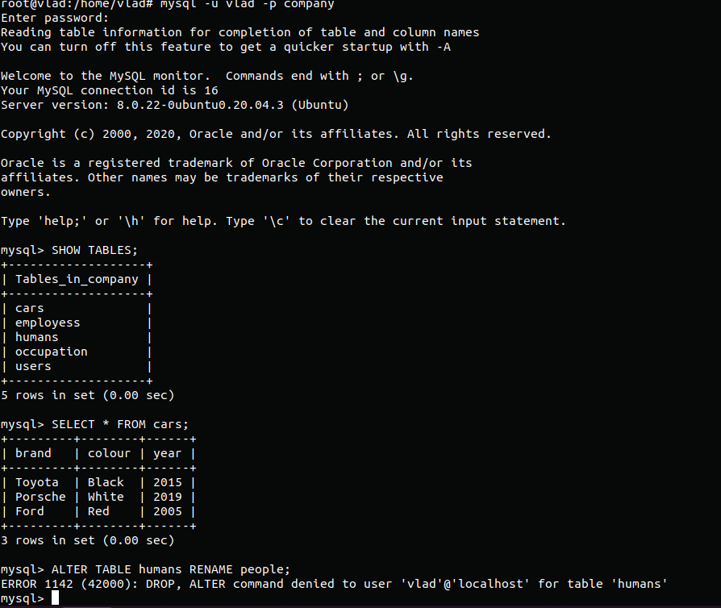

6. Make selection from the main MySQL Database

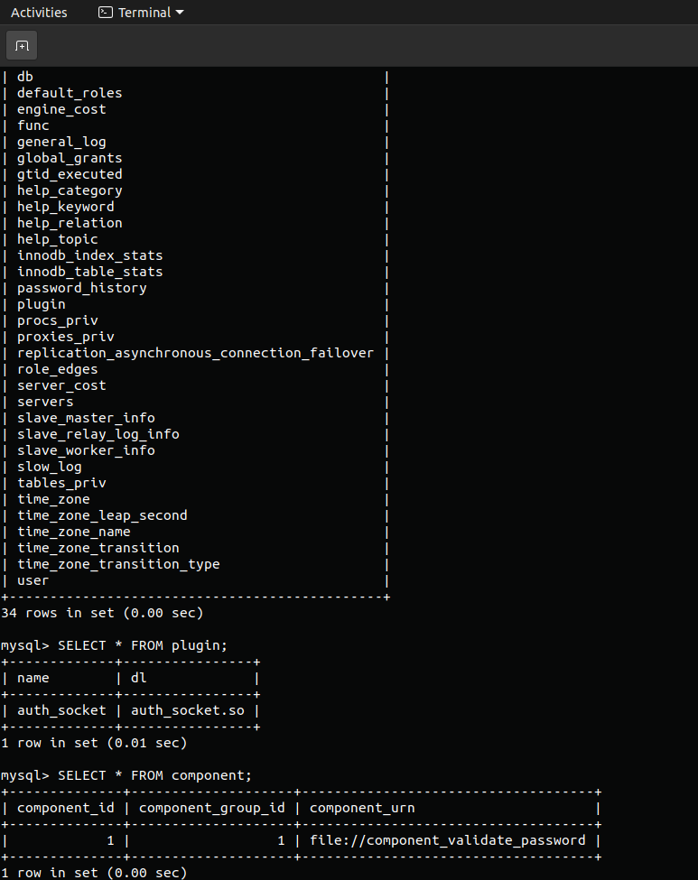

7. Make a backup

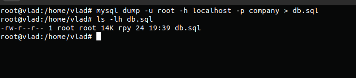

8. Deleted one table and then restore it from backup
         
         
          mysql -u root -h localhost -p < db.sql 

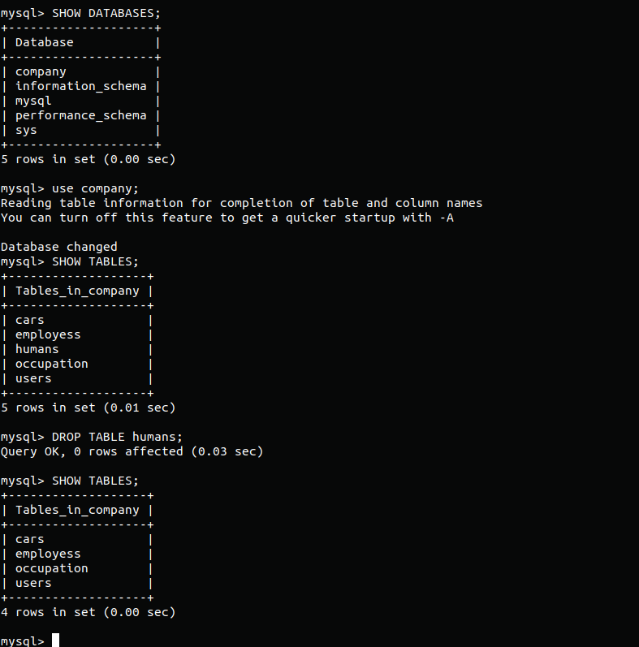
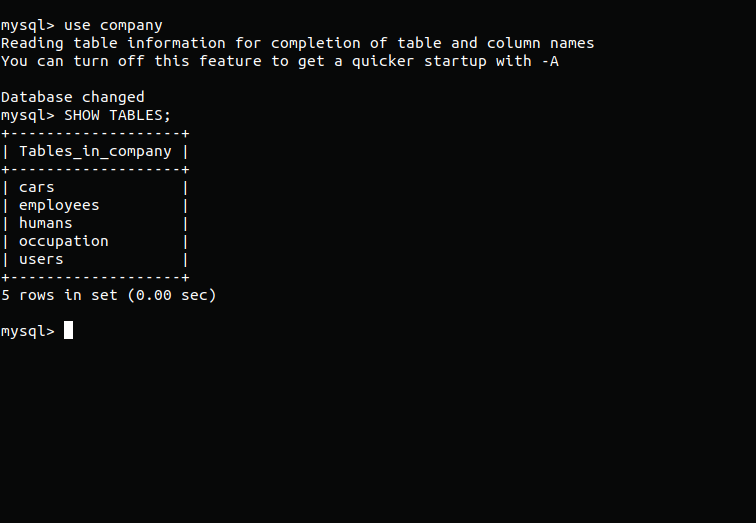

10. Transfer my local database to RDS AWS

        mysql -h aws-database.ck9tzjykwhfk.eu-central-1.rds.amazonaws.com -P 3306 -u admin -p company < backup.sql
        
        
 
  
11. Created RDS in AWS & connect to it via MySQL Workbench. Executed SELECT operator
 
 
 
  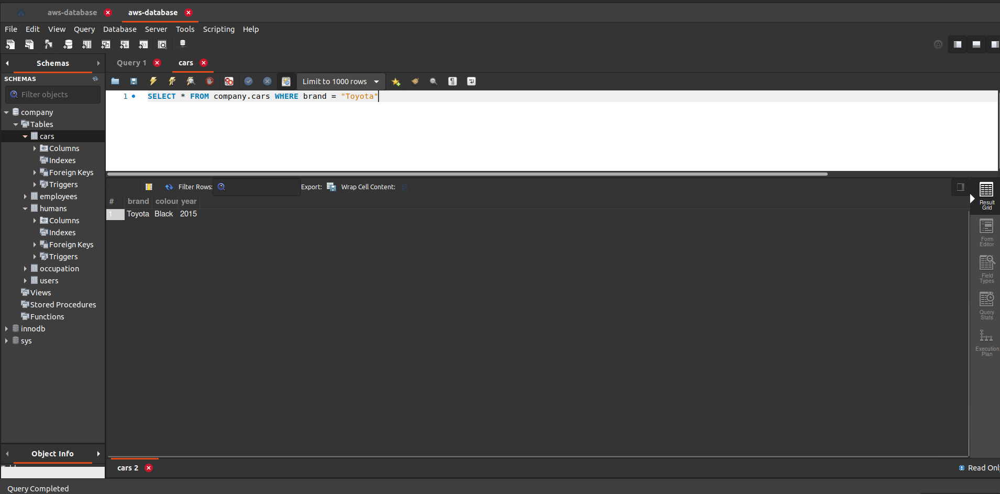  
  
  

  12. Created an Amazon DynamoDB table and entered some data there. Then query an Amazon DynamoDB table using Query and Scan options.
  
  p.s Of course Jenkins is using for CI/CD, small error on the screenshots :)  
  
  
  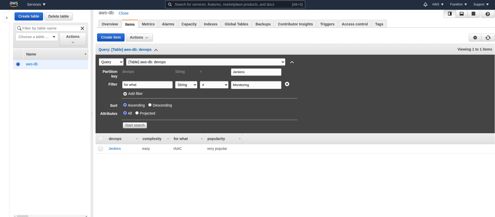  
  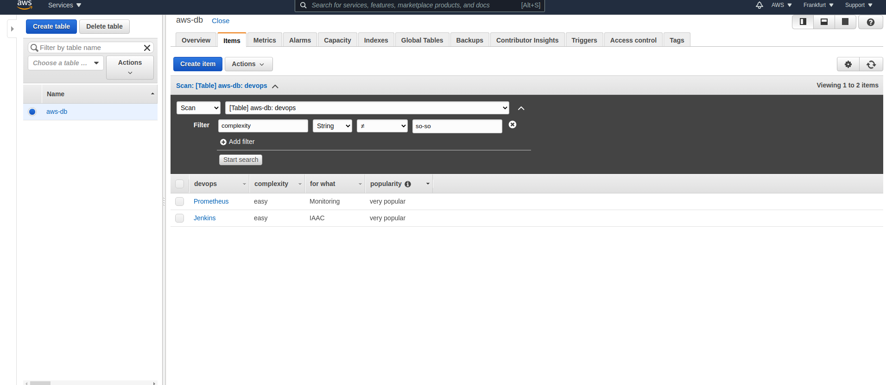  
 
