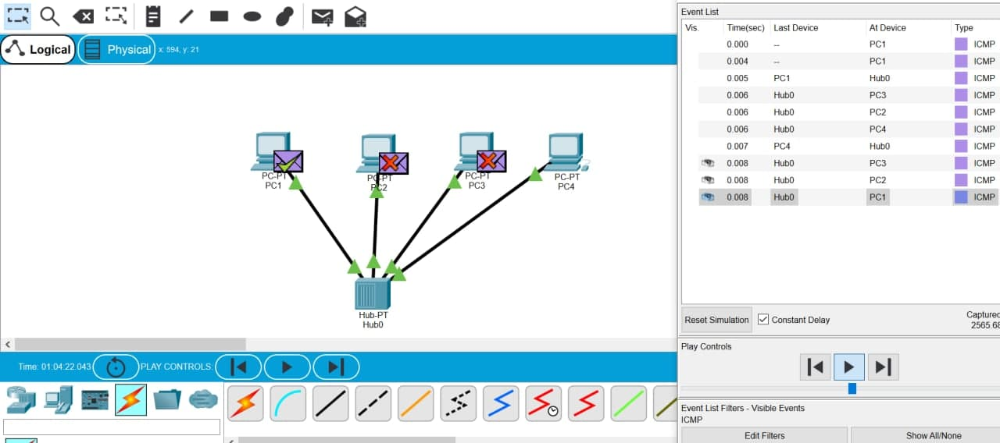
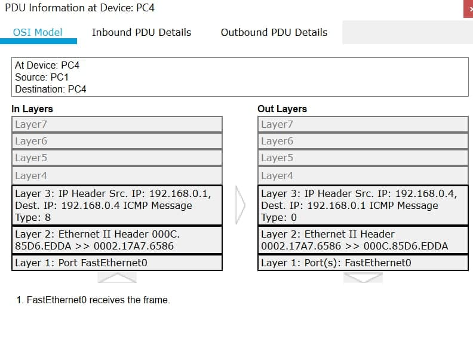
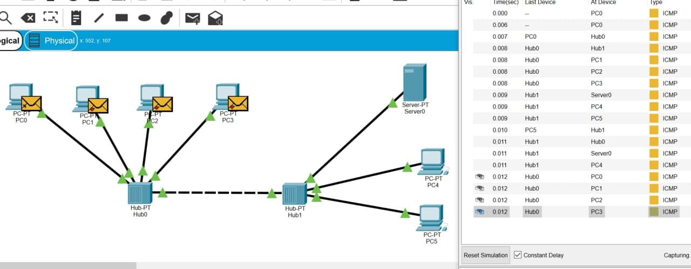
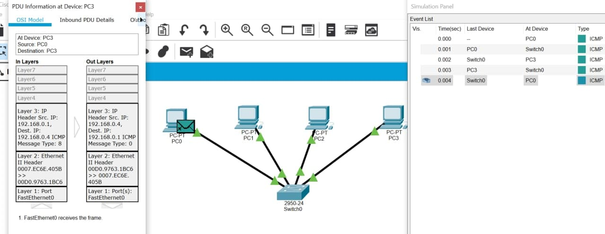
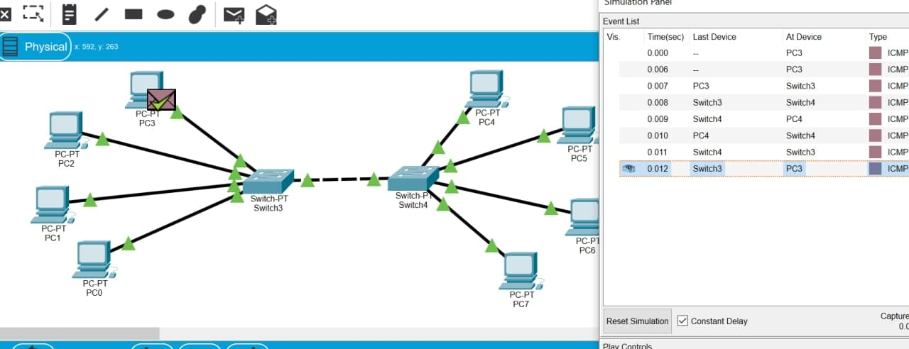
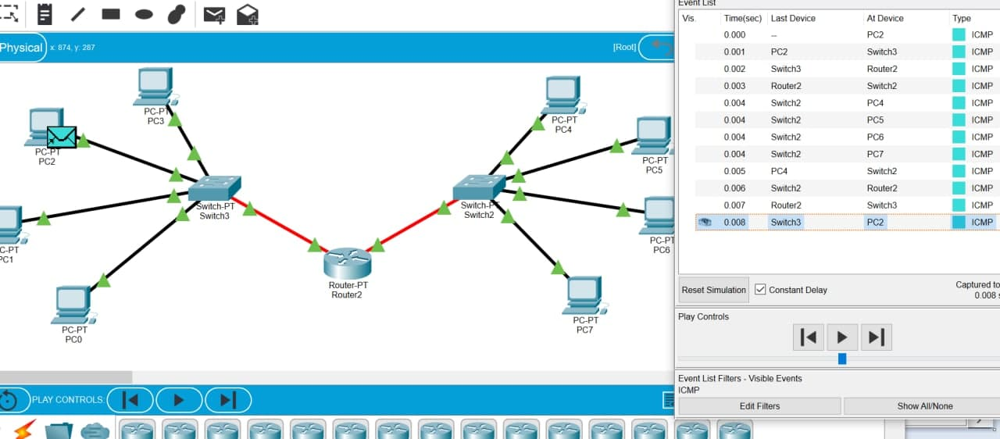

1. Hub transmits packets to all computers on the network

2. PDU for this packets

3. Packets transmits through two hubs within a subnet

4. Unlike a hub, in this case packets from PC0 transmits through Switch only to the dedicated computer (PC3)

5. Added additional modules to the swithes. Packets transmits through two swithes between two computers

6. Configured the gateway and another subnet. Now packets are transmitted between different subnets through a router.

