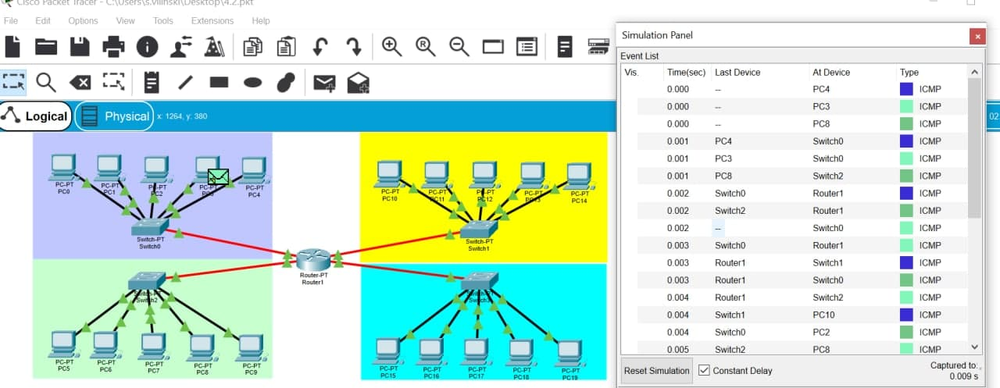
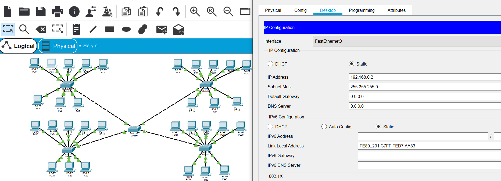
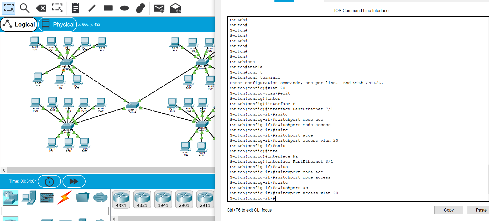
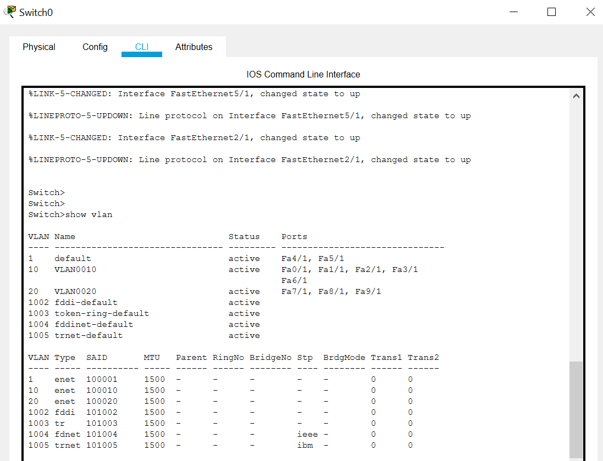
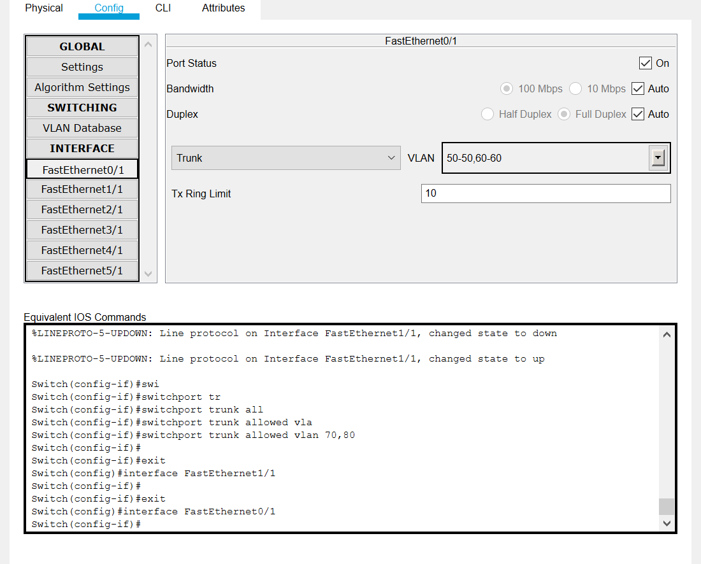

4.2.1

1. Created a simple corporate network. All computers can ping each other and packets are transferred successfully via router.

4.2.2

1. Сreated a network using switches and 8 subnets. Gave a unique IP address to each computer on the network.

2. Configuring VLAN's on switch ports.

3. Configuring trunk ports on the main switch.

