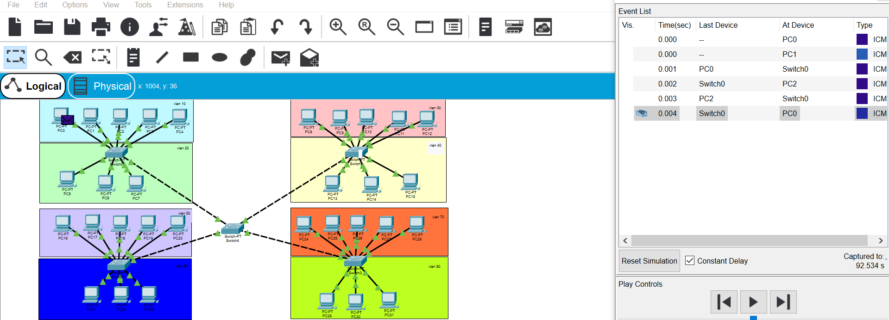

4.2.1

1. Created a simple corporate network. All computers can ping each other and packets are transferred successfully via router. (different colours in this case doesn't mean VLAN's)

4.2.2

1. Сreated a network using switches and 8 subnets. Gave a unique IP address to each computer on the network.

2. Configuring VLAN's on switch ports.

3. Configuring trunk ports on the main switch.

4. We can see that packets are successfully transmitted between computers in the one VLAN and doesn't tranmitted to another VLAN. They proceed to the status FAILED because this computers located in the different VLAN's.

4.2.3

1.  Did almost the same thing in 4.2.2. In this case I configured switches  0, 1, 2, 3, 4 (VLAN's) like in 4.2.2 and assigne appropriate IP addresses. Then configured trunk port on the main switch and configured subinterface on Router. Finally, we can see that we can ping not only the appropriate VLAN from PC, but also a relative subinterface.

