Task1.Part1

Change password:

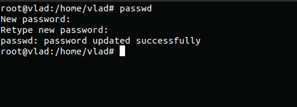

Determine the users registered in the system:

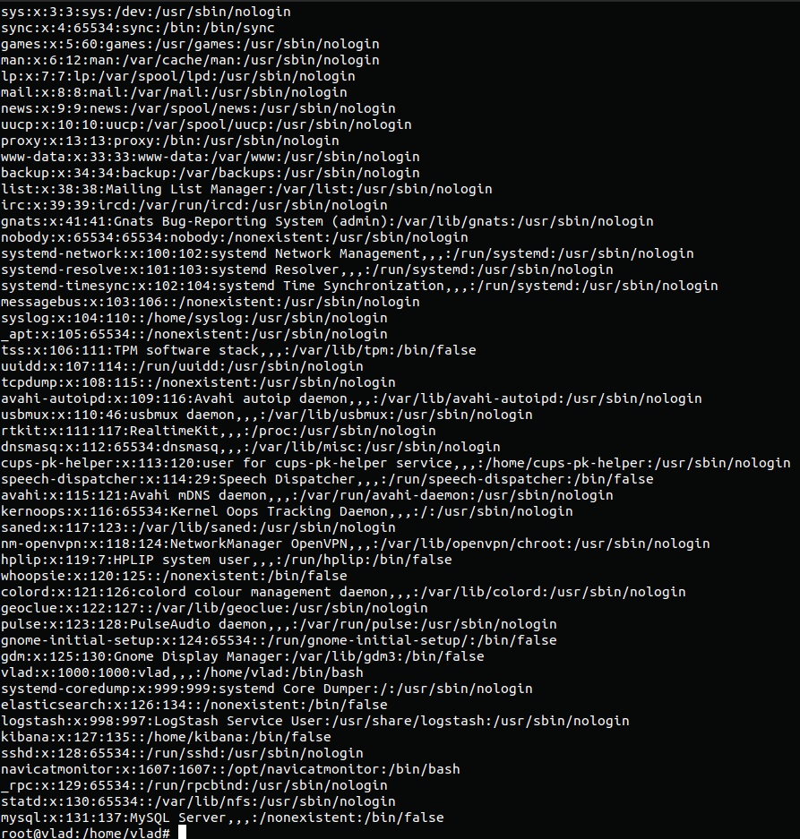  

Change personal information about yourself:

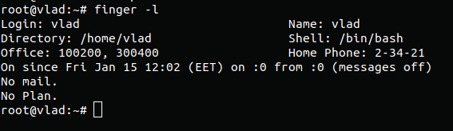 

Man & Info commands:

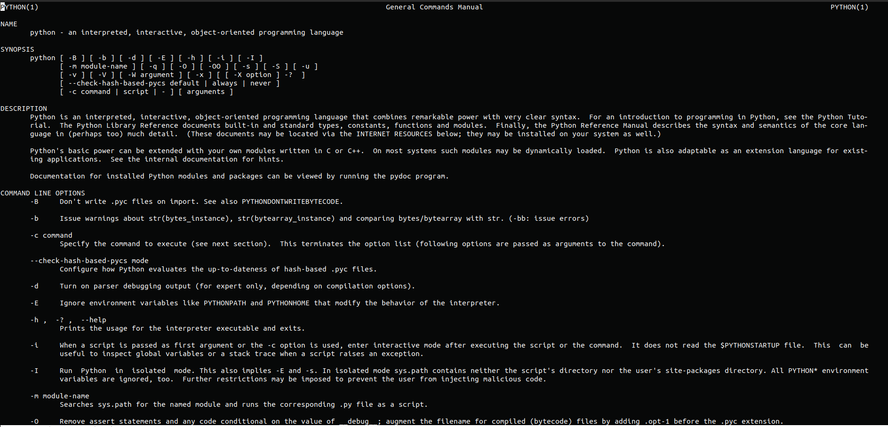 

More & Less commands:

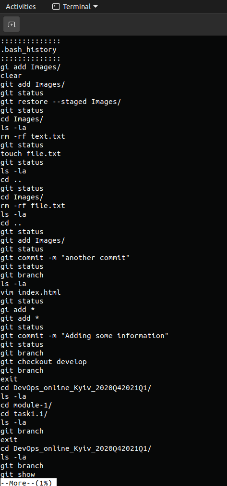 
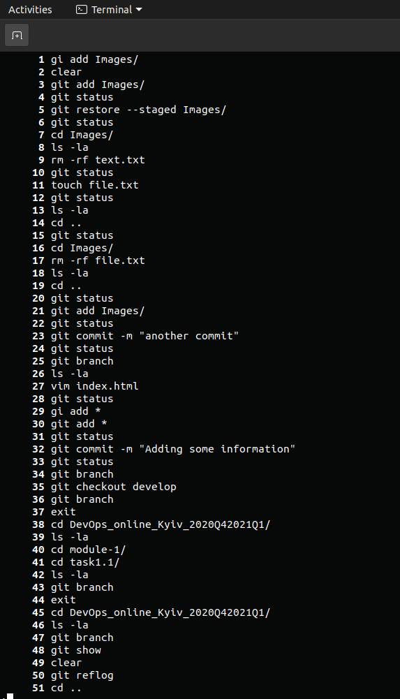 

Describe plan: 

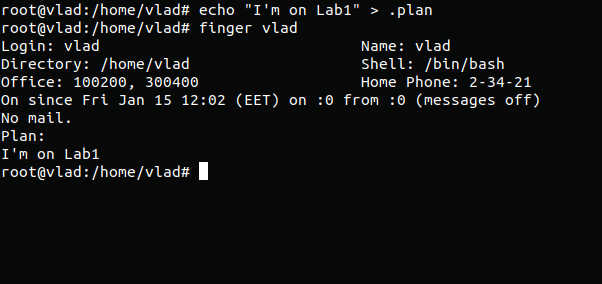 

List the contents of the home directory:

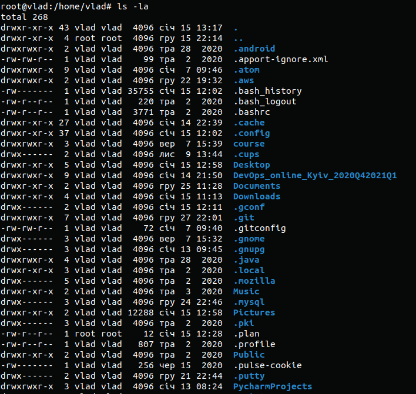 

Task1.Part2

Examined tree command and list subdirectories of the root directory up to
and including the second nesting level:

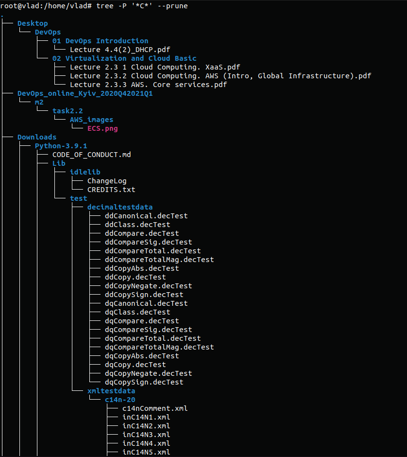
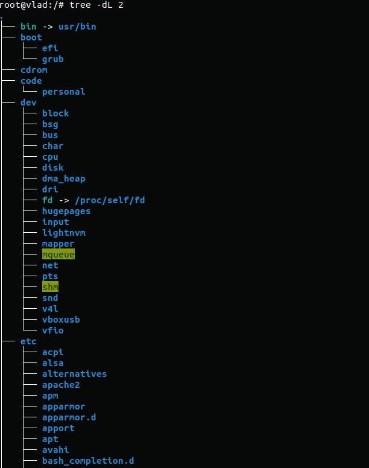

Determine the type of file:

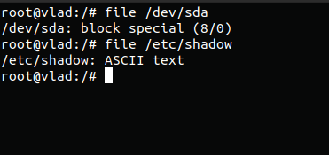

Relative and absolute paths:

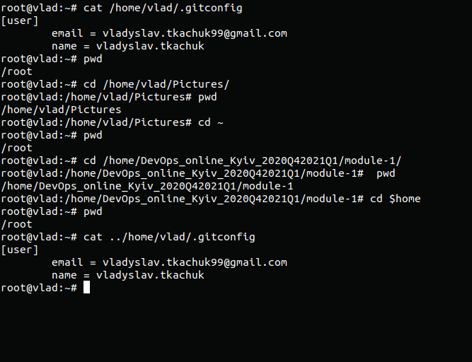

ls navigation:

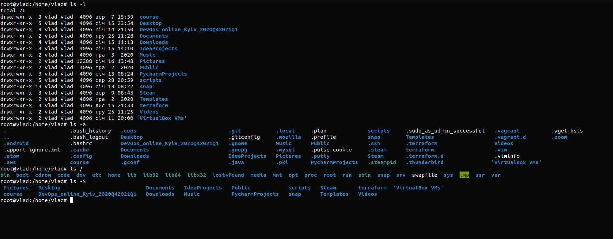

Perform some operations with test directory:

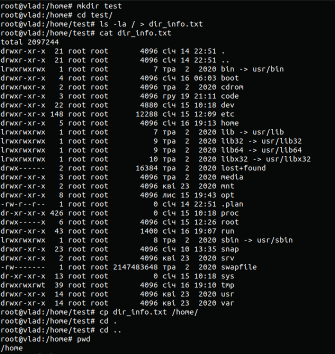

Perform testing for "labwork2":

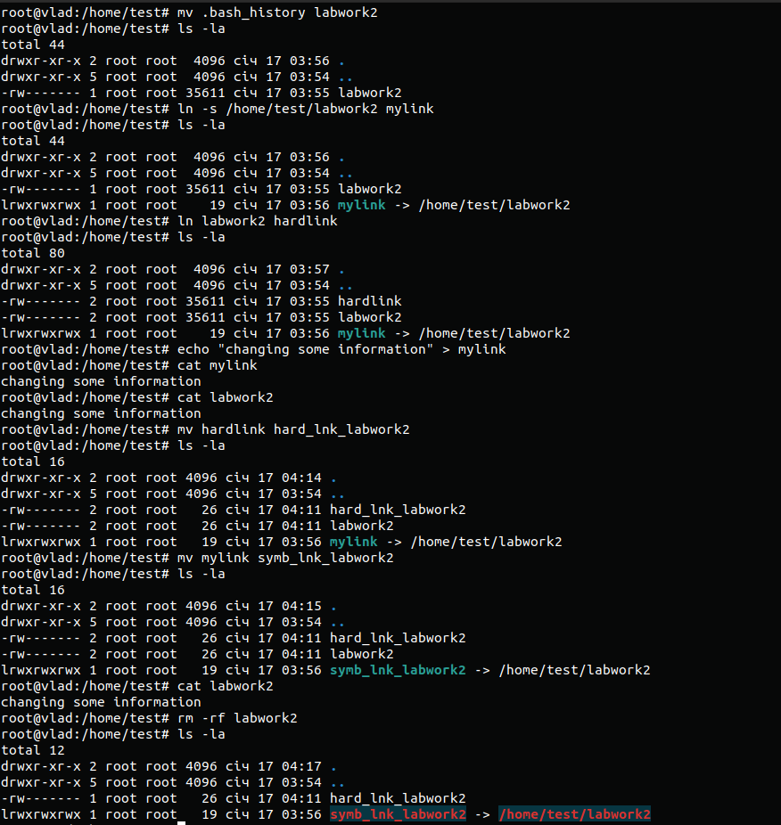

Locate utility usage, also determined which partitions are mounted in the system::

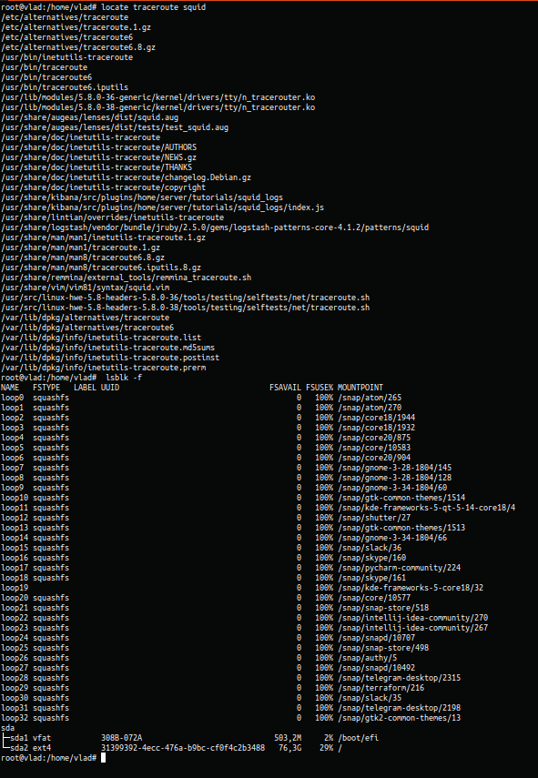

Count the number of lines, find all files in the /etc directory containing the host character sequence and list all objects in /etc that contain the ss character sequence:

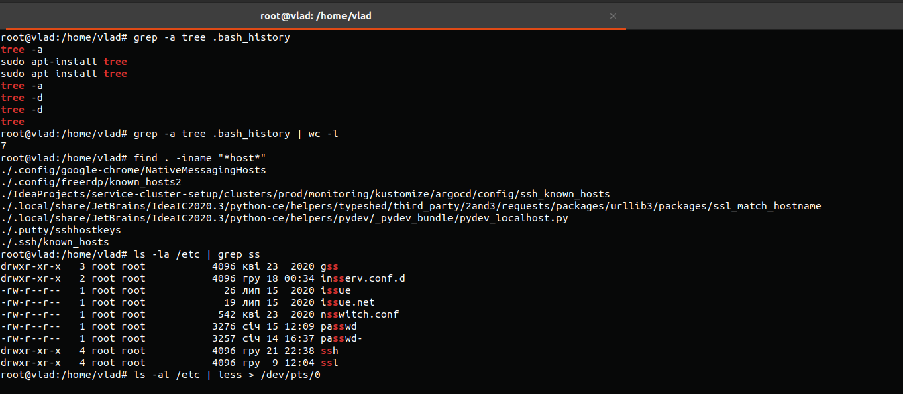

Organized a screen-by-screen print of the contents of the /etc directory:

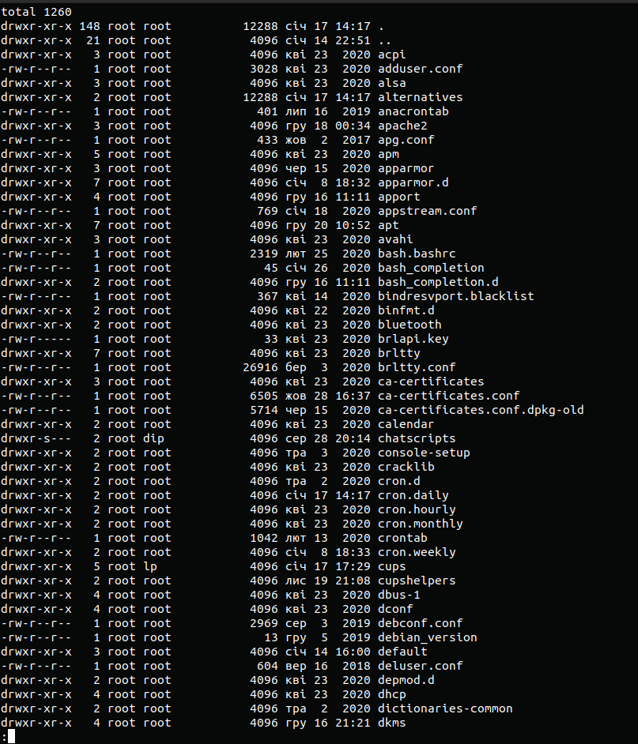

                 ls -al /etc | less > /dev/pts/0

Types of devices:

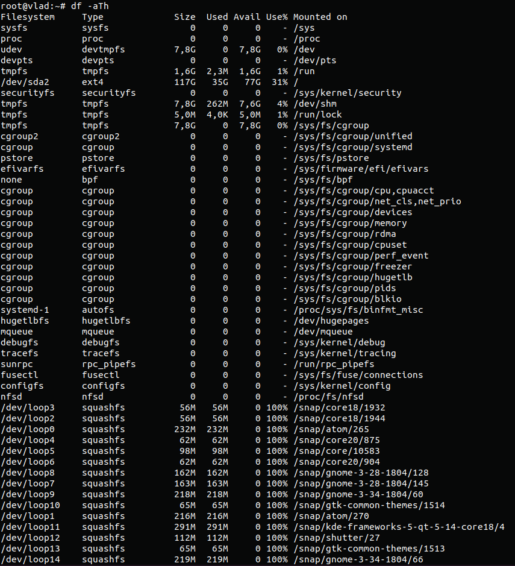

Determined the type of file in the system and list the first 5 directory files that were recently accessed in the /etc
directory:

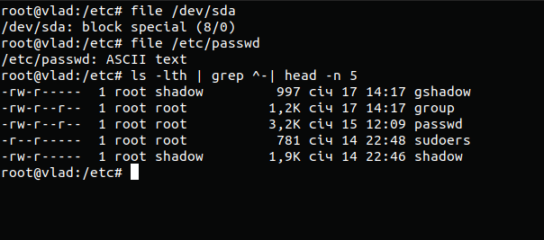

