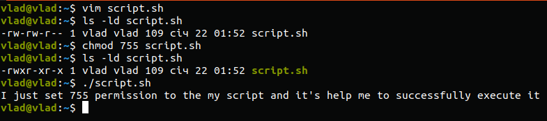

For example, mysql, kibana and sshd are pseudo-users, they have their UID < 1000 otherwise users UID always > 1000

UID - User identifier,
We can execute command cat /etc/passwd after this we will see all users in the system and their UID.

GID - Group identifier

                cat /etc/group

To determine belonging of user to the specific group we can type 'groups' + user's name.

for example: groups mysql

In case we want to add a user to the system we use useradd command. If we specify -m instead of -M, Linux will also create a home directory for this user

if you want to change the name of existing user you should type:
usermod -l login-name old-name

Skel_dir - user's skeleton directory. Contains standard files that define the standard user environment on the system.

We can use command userdel with -r option to delete user from the system

in case we need to lock and unlock a user account we'll use command passwd --lock "user"

passwd --delete "user" -  this command helps us to delete user's password

sudo passwd --expire "user" - this is how to force user to change password at next login

first column: access rights

second column: number of files in the directory ( 1 for actual file)

third column: owner

fourth column: group

fifth column: actual size

last column: creation date

There are three types of access rights:

Read - allows to receive the contents of the file, but not to write. For a directory, allows you to get a list of files and directories located in it.

Write - allows you to write new data to a file or modify existing ones, and also allows you to create and modify files and directories.

Execution - You cannot execute a program if it does not have an execution flag. This attribute is set for all programs and scripts, it is with it that the system can understand that this file needs to be run as a program.

Rights exist for:

Owner - a set of rights for the owner of the file, the user who created it or is now set by its owner. Usually the owner has all rights, read, write and execute.

Group - any user group that exists in the system and is associated with a file. However, this can only be one group, and it is usually the owner's group, although another group can be assigned to a file.

Others - all users except the owner and users in the file group.

Chown is used to change the owner of a file (directory) and Chmod is used to change the mode of access to the file.

umask command:

This is an example of octal representation of access rights. We change our access rights to the directory .zoom from 755 to 400 with chmod command. 
We can check this by typing stat "name of catalog/file"

The sticky bit is working on the directory. If the sticky bit is set for a directory, all files in the directory can only be deleted or renamed by the owners of the files or by the root user.

7 - read, write, execute allowed

6 - read and write allowed

5 - read and execute allowed

4 - read only allowed

0 - nothing is allowed

The first argument to chmod is three digits: the first is the owner's rights, the second is the group, and the third is the rest.

We should give a 755 access to our script.

