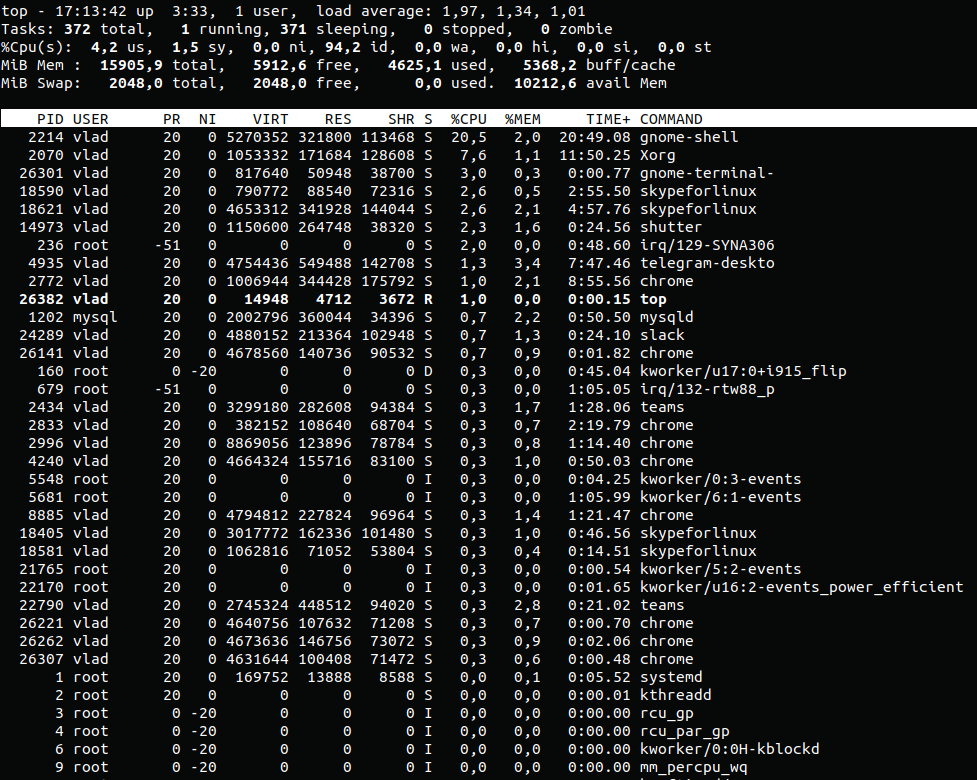

Part1

1.Linux has basically 4 states

Running – here it’s either running (it is the current process in the system) or it’s ready to run (it’s waiting to be assigned to one of the CPUs).

Waiting – in this state, a process is waiting for an event to occur or for a system resource. Additionally, the kernel also differentiates between two types of waiting processes; interruptible waiting processes – can be interrupted by signals and uninterruptible waiting processes – are waiting directly on hardware conditions and cannot be interrupted by any event/signal.

Stopped – in this state, a process has been stopped, usually by receiving a signal. For instance, a process that is being debugged.

Zombie – here, a process is dead, it has been halted but it’s still has an entry in the process table.

2. The -h option tells pstree to include the current process and all of its ancestors.

pstree -h

3.The proc file system acts as an interface to internal data structures in the kernel. It can be used to obtain information about the system and to change certain kernel parameters at runtime (sysctl).

4.

5. 

6. By default "pstree" without parameters shows only the tree of processes spawned by init - user processes. Kernel processes will show "sudo pstree 2" 

   

7. Processes condition:

       D    uninterruptible sleep (usually IO)

       R    running or runnable (on run queue)

       S    interruptible sleep (waiting for an event to complete)

       T    stopped by job control signal

       t    stopped by debugger during the tracing

       W    paging (not valid since the 2.6.xx kernel)

       X    dead (should never be seen)

       Z    defunct ("zombie") process, terminated but not reaped by its parent

We can see this by running "ps -q <pid> -o state --no-headers"  

8.  

9.ps -Af - detailed information about all processes 

 

    The -C option allows you to filter processes by name, for example, select only slack processes 

 

    cpu load percentage: ps -FA --sort pcpu

   The total number of running Linux processes can be found with the command:  ps -e | wc

10.

PID - process identifier 

USER - the name of the user who owns the process 

PR - process priority 

NI - "NICE" value, affecting the priority of the process 

VIRT - the amount of virtual memory used by the process 

RES is the amount of physical memory used by the process 

SHR - the amount of shared memory of the process 

S - indicates the status of the process: S = sleep (waiting for events) R = running (running) Z = zombie (waiting for the parent process) (S)

% CPU - percentage of CPU used by this process 

% MEM - percentage of RAM used by this process 

TIME + - total process activity time 

COMMAND - process name

  

11. top -u root

 

12. 

q or Esc - exit top;

L - search by word;

V - displaying processes in the form of a tree;

u - filtering processes by username;

13. 

top -o %CPU - sort by CPU

top -o %MEM - sort bt memory usage 

14. 

The linux process priority means how much more CPU time will be devoted to this process compared to others.

priority for the started process:

nice -n 10 apt-get upgrade

Or change the priority for an existing one by its pid:

 renice -n 10 -p 1346

15. 

Step 1: examine the command sudo top

Step 2: press r and choose your PID

Step 3: renice this PID to your value from -20 to +19 and press enter

16. 

SIGINT - simple process termination

SIGHUP - informs the process that the connection with the controlling terminal has been broken, sent mainly by the system when the connection to the Internet is broken

         kill  "pid process"

17.

fg - task resume command

bg - continue execution in the background

jobs - display a list of currently running background tasks

nohup - allows you to ensure that your job continues to run autonomously after logging out of your system session.

Part2

1.

2. 

3.

4. 

