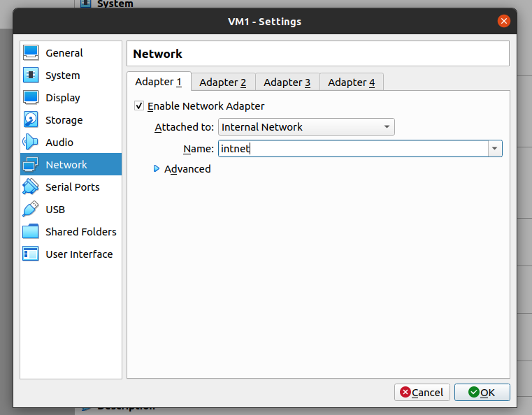

Set up interfaces for VM1 and VM2

Enabled forwarding:

Set iptables rules:

Set netplan config for VM1 and VM2:

Test connection between VM1 and VM2:

Checked the connection between VMs:

Checked the route from VM2 to the host:

Checked the access to the internet:

Determined, which resource has an IP address 8.8.8.8:

Determined, which IP address belongs to resource epam.com:

Determined the default gateway to the my host and displayed routing table:

Trace the route to google.com:

