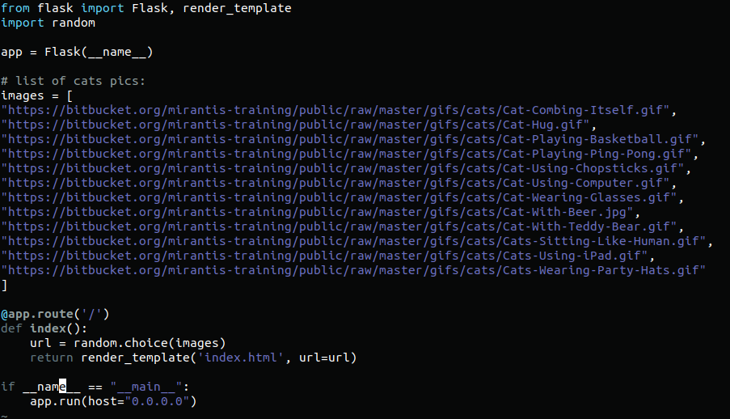

Creating app.py:

Creating DockerFile:

Creating index.html file:

Create a new file requirements.txt with the following line:

       Flask==0.10.1

Build a Docker image:

       docker build -t vlad/mycatapp .

Check that my image exists:

 Run a container in a background and expose a standard HTTP port (80), which is redirected to the container’s port 5000

      
        docker run -dp 80:5000 --name myfirstapp vlad/mycatapp

Login to DockerHub and push our image:

        docker login
         
        docker tag vlad/mycatapp vladtkachuk09/mycatapp

And it works!

